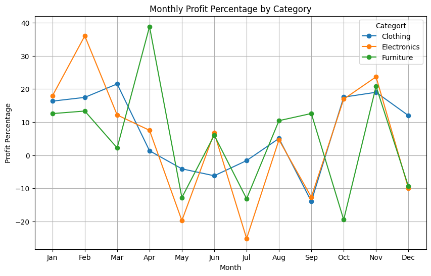
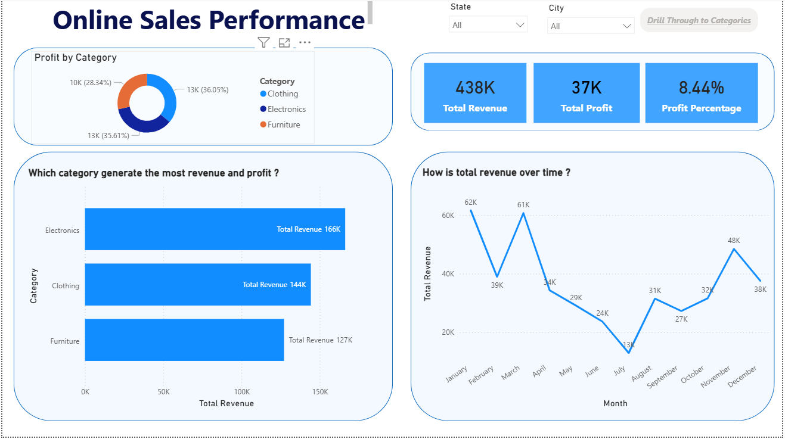
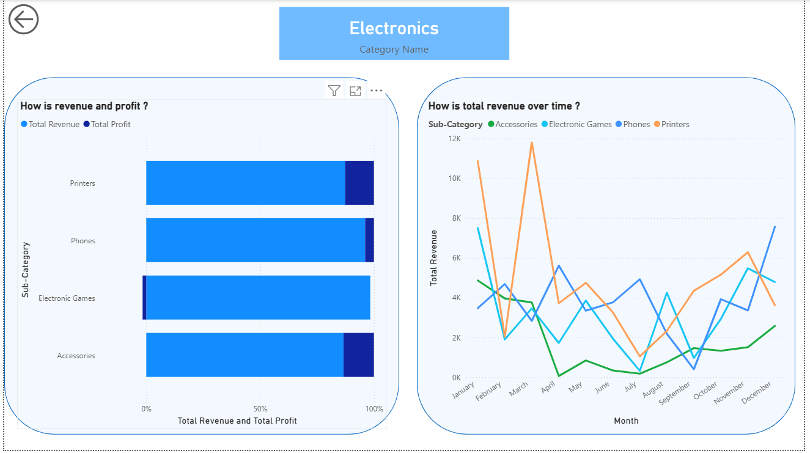

# Online-Sales-Data-Analysis---Python-SQL-Power-BI
This project analyzes online sales data to understand sales performance, product trends, and regional profitability. 

**SQL** queries executed via **Python** were used to extract business-critical insights, which were then visualized using **Power BI dashboard** to support management decision making. 
 
## Business Problem

**How can the company use historical sales data to identify revenue drivers, top-performing products and regions, and customer purchasing patterns in order to increase sales and improve business decisions?**

## Dataset
https://www.kaggle.com/datasets/samruddhi4040/online-sales-data/data?select=Orders.csv

The project uses two related datasets with 500 order details.

1. Orders.csv :
 Order ID (primary key), Order Date, CustomerName, State, City 
2. Details.csv :
   Order ID (primary key) and the details of all the subsequent orders

- Initial data cleaning and necessary transformation were performed.
  
## Analysis and Results   

- **Electronics** generates the highest revenue (**166,267.00**), with a total quantity sold of 1,154.
- The total profit approximately equal for Electronics and Clothing items; however Clothing records the **highest profit percentage at 9.23%**. 

Table 1: Sales performance summary by product category
| Category      | Total Revenue | Total Profit | Profit Percentage (%) | Total Quantity |
|--------------|---------------|--------------|------------------------|----------------|
| Electronics  | 166,267       | 13,162       | 7.92                   | 1,154          |
| Clothing     | 144,323       | 13,325       | 9.23                   | 3,516          |
| Furniture    | 127,181       | 10,476       | 8.24                   | 945            |

- Within the Clothing category, the most profitabe sub-categories are Sarees and Trousers. In the Electronic catogory, the highest revenue and profits are generated from Printers, while in Furniture, Bookcases contribute the most to overall revenue.

- The **highest profit percentage** are observed in **February and November**. However the sales experiences negative profitability in May, July, September and December.

Table 2: Monthly performance
| Month | Total Revenue | Total Quantity | Profit Percentage (%) |
|------|---------------|----------------|------------------------|
| Jan  | 61,632        | 745            | 15.71                  |
| Feb  | 38,962        | 512            | 21.73                  |
| Mar  | 60,694        | 751            | 12.84                  |
| Apr  | 34,330        | 389            | 12.21                  |
| May  | 29,093        | 423            | -12.82                 |
| Jun  | 23,658        | 369            | 1.78                   |
| Jul  | 12,966        | 240            | -16.49                 |
| Aug  | 31,492        | 446            | 6.57                   |
| Sep  | 27,283        | 331            | -5.13                  |
| Oct  | 31,613        | 419            | 9.36                   |
| Nov  | 48,469        | 578            | 21.15                  |
| Dec  | 37,579        | 412            | -4.27                  |

Table 3: Monthly profit percentage by category
| Month | Clothing (%) | Electronics (%) | Furniture (%) |
|------|---------------|------------------|---------------|
| Jan  | 16.32         | 17.91            | 12.56         |
| Feb  | 17.45         | 36.00            | 13.33         |
| Mar  | 21.51         | 12.15            | 2.20          |
| Apr  | 1.35          | 7.52             | 38.80         |
| May  | -4.10         | -19.70           | -12.77        |
| Jun  | -6.19         | 6.74             | 6.04          |
| Jul  | -1.61         | -25.12           | -13.12        |
| Aug  | 5.07          | 4.65             | 10.43         |
| Sep  | -13.94        | -12.63           | 12.59         |
| Oct  | 17.53         | 16.92            | -19.45        |
| Nov  | 18.99         | 23.65            | 20.79         |
| Dec  | 11.97         | -10.00           | -9.40         |

- Furniture, Electronic and Clothing items high profit shows in April, February, and March, respectively.  

  

<em>Figure 1: Monthly profit performance</em>

 
- Indore and Mumbai generate the highest revenue and order volumes, indicating strong regional demand.  
However, some cities such as Hyderabad, Jaipur, and Prayagraj report negative profits, highlighting potential pricing, cost, or discount-related issues that require further investigation.

Table 4: Performance by State and City
| State | City | Total Revenue | Total Profit | Total Quantity | Order Count |
|------|------|---------------|--------------|----------------|-------------|
| Andhra Pradesh | Hyderabad | 13,256 | -280 | 146 | 15 |
| Bihar | Patna | 13,417 | 1,787 | 206 | 16 |
| Delhi | Delhi | 22,957 | 1,958 | 290 | 24 |
| Goa | Goa | 6,705 | 350 | 145 | 14 |
| Gujarat | Ahmedabad | 14,543 | 1,846 | 235 | 17 |
| Gujarat | Surat | 6,828 | 1,155 | 93 | 10 |
| Haryana | Chandigarh | 8,863 | 1,325 | 111 | 14 |
| Himachal Pradesh | Simla | 8,666 | 1,662 | 113 | 14 |
| Jammu and Kashmir | Kashmir | 10,829 | 208 | 177 | 14 |
| Karnataka | Bangalore | 12,520 | 449 | 166 | 20 |
| Kerala | Thiruvananthapuram | 13,871 | 2,435 | 157 | 16 |
| Madhya Pradesh | Indore | 63,680 | 6,763 | 980 | 71 |
| Madhya Pradesh | Bhopal | 23,783 | 619 | 247 | 22 |
| Maharashtra | Mumbai | 58,886 | 803 | 699 | 67 |
| Maharashtra | Pune | 43,612 | 6,160 | 392 | 27 |
| Nagaland | Kohima | 11,993 | 40 | 173 | 15 |
| Punjab | Chandigarh | 12,279 | 1,453 | 164 | 16 |
| Punjab | Amritsar | 4,507 | 118 | 52 | 9 |
| Rajasthan | Jaipur | 11,261 | -275 | 167 | 19 |
| Rajasthan | Udaipur | 11,073 | -48 | 115 | 13 |
| Sikkim | Gangtok | 5,276 | 401 | 93 | 12 |
| Tamil Nadu | Chennai | 6,276 | 2,602 | 91 | 8 |
| Uttar Pradesh | Mathura | 28,747 | 3,335 | 194 | 6 |
| Uttar Pradesh | Lucknow | 5,726 | 156 | 150 | 13 |
| Uttar Pradesh | Prayagraj | 3,889 | -133 | 43 | 6 |
| West Bengal | Kolkata | 14,328 | 2,074 | 216 | 22 |

## Power BI dashboard
[▶️ Watch demo video](Outputs/yPower_BI.mp4)

  

<em>Page 1 - Home Page</em>

  

<em>Page 2 - Using Drill Through</em>

